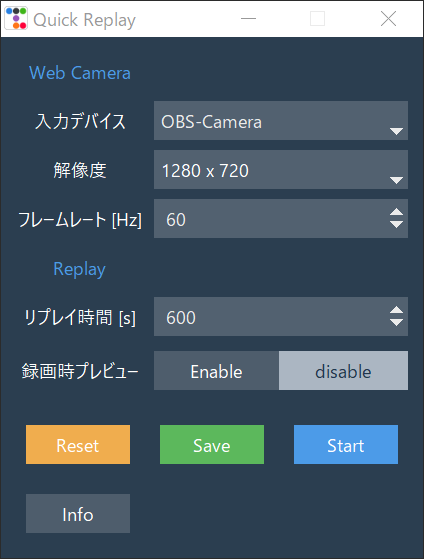
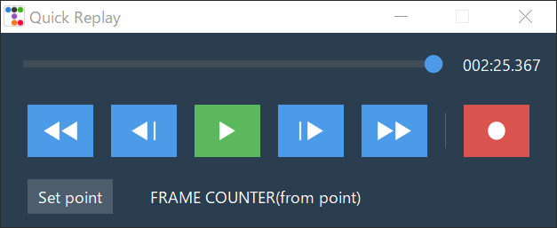
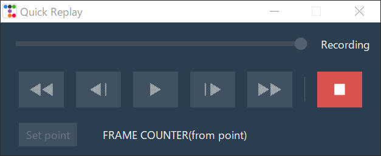

# QuickReplay

Webカメラの出力を記録し、簡単にリプレイなどを行えるソフト。  

## 機能
* リプレイ機能（コマ送り、コマ戻し、早送り、早戻し、等速再生）
* フレームカウンター（指定したフレームからのフレーム差、時間の差を表示する）

  

# Setup

## Use Binary
[リリースページ](https://github.com/Nanahuse/QuickReplay/releases)から最新版のzipファイルをダウンロードしてください。  
インストール不要で解凍すれば使えます。

## Use Python
requiments.txtが用意してありますが、[yushulx/python-capture-device-list](https://github.com/yushulx/python-capture-device-list)がpip経由では上手くインストールできないため除いてあります。別途手動でインストールしてください。

  

# 使い方
## 設定画面
### WebCameraに関する設定
入力デバイス、解像度、フレームレートを指定してください。設定可能なフレームレートは入力デバイスによって異なるので確認してください。
### Replayに関する設定
リプレイ時間にはリプレイを保存する長さを秒単位で指定してください。リプレイ時間が長くなるほど大きな保存容量が必要になります。

録画時プレビューでは録画時にプレビュー画面を開くかどうかを設定します。録画時にプレビュー画面を閉じることでドロステ効果を防止します。[ドロステ効果 - Wikipedia](https://ja.wikipedia.org/wiki/%E3%83%89%E3%83%AD%E3%82%B9%E3%83%86%E5%8A%B9%E6%9E%9C)

### Save & Reset
「Save」を押すことで現在の設定を保存できます。次回実行時には自動で読み込まれます。  
「Reset」を押すと直前にSaveしたデータを読み込むことができます。

### Start
設定が終わったら「Start」を押すと実行画面に変わります。  
入力デバイスが開けなかった場合はエラー画面になります。

 

## 実行画面
### フレームカウンターの使用方法
1. 録画、再生を行っていない状態で実行画面左下の「Set point」を押す。
1. 「Set point」を0としたときの現在の表示フレームのフレーム数とタイムが表示される。
### リプレイ中の画面

### 録画中の画面  

 

## OBSとの連携させて使用する場合のおすすめ

OBSで使用する場合はobs-virtual-camというプラグインが便利です。  
画面全体をWebカメラとして出力したり、フィルタを使うことで映像ソースを直接Webカメラに出力できます。
* [OBS 27まで](https://github.com/Fenrirthviti/obs-virtual-cam/releases)
* [OBS 28以降](https://github.com/Avasam/obs-virtual-cam/releases) 

※インストーラー版がおすすめです。zip版ではコマンドラインから作業が必要になります。